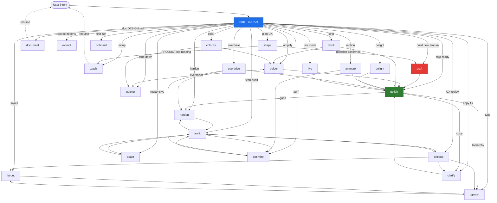

# Impeccable v3 — Inter-command Routing Graph

## Visual graph (Mermaid)



## Routing table (from → to → trigger)

| FROM | TO | TRIGGER |
|---|---|---|
| `SKILL.md root` | any | initial dispatch via Routing rules |
| `shape` | `craft` | direction confirmed; Gate 1 confirmed |
| `shape` | `teach` | PRODUCT.md missing/empty |
| `teach` | (resume original command) | PRODUCT.md written + context refreshed |
| `document` | (resume) | DESIGN.md written |
| `craft` | `polish` | build done, final pass |
| `craft` | `harden` | production gaps surfaced |
| `craft` | `live` | dev server up, want in-browser variants |
| `critique` | `clarify` | copy problem |
| `critique` | `audit` | technical concern |
| `critique` | `layout` | rhythm broken |
| `critique` | `typeset` | hierarchy broken |
| `audit` | `critique` | UX issue surfaced |
| `audit` | `optimize` | perf dominant |
| `audit` | `adapt` | responsive miss |
| `audit` | `harden` | edge case / overflow / i18n |
| `polish` | `harden` | production gap |
| `polish` | `clarify` | copy issue |
| `polish` | `typeset` | hierarchy at small sizes |
| `polish` | `critique` | composition wrong (foundation issue) |
| `bolder` ↔ `quieter` | (the inverse) | overshot/undershot |
| `bolder` / `quieter` | `polish` | final pass |
| `distill` | `bolder` | result feels skeletal |
| `distill` | `polish` | after stripping |
| `harden` | `audit` | verify hardening |
| `harden` | `clarify` | copy in error states unclear |
| `onboard` | `harden` | empty/error/loading need design |
| `onboard` | `clarify` | onboarding copy |
| `onboard` | `delight` | activation celebration |
| `animate` | `polish` | after motion added |
| `animate` | `optimize` | perf impact |
| `colorize` | `bolder` | want palette amplification |
| `colorize` | `quieter` | too loud after |
| `typeset` | `layout` | hierarchy fix reveals layout gap |
| `layout` | `typeset` | spacing fix reveals type gap |
| `layout` | `adapt` | breakpoint broken |
| `delight` | `polish` | after personality added |
| `overdrive` | `polish` | after spectacle |
| `overdrive` | `optimize` | perf cost |
| `overdrive` | `harden` | edge cases of effects |
| `clarify` | `polish` | after copy fix |
| `adapt` | `audit` | verify responsive |
| `adapt` | `layout` | broken fundamentals |
| `optimize` | `audit` | verify all dimensions |
| `optimize` | `distill` (NOT) | optimize ≠ remove features |
| `live` | `polish` | after accepting variant |
| `extract` | `document` | refresh DESIGN.md with new tokens |
| `extract` | `polish` | drift cleanup |

## Gate rules (hard constraints)

1. **Every** command starts with SKILL.md Setup (PRODUCT.md + register + command reference)
2. **craft Gate 1** (shape confirmed) MUST be confirmed via `checkpoint.mjs --gate=1`
3. **craft Gates 2-4** (on Codex) MUST be confirmed via `checkpoint.mjs --gate=2|3|4`
4. **No command chains silently** — emit routing suggestion + STOP
5. **`live.md` (622L origin / 300L v3)** loaded ONLY in live mode (not by SKILL.md root)
6. **`impeccable_asset_producer`** invoked ONLY on Codex (other harnesses get fallback message)
7. **commands table** in README.md and SKILL.md MUST match `scripts/command-metadata.json` (build-time check)
8. **27 anti-pattern rules** consumed via `defineCheck()` registry (no manual adapter wiring)

## Composite flows (end-to-end production patterns)

### A) Build + ship a new brand landing page
```
SKILL.md (Setup, register=brand)
  → shape (Gate 1)
  → craft → load codex.md if Codex (Gates 2-4)
            → impeccable_asset_producer
            → build
  → polish
  → harden (if production)
  → ship
```

### B) Build + ship a new product feature
```
SKILL.md (Setup, register=product)
  → shape
  → craft (Gates 2-4 if Codex, else asset fallback message)
  → polish
  → harden (errors + i18n + edge cases)
  → audit (verify a11y + perf + responsive)
  → ship
```

### C) Debug a failing feature
```
SKILL.md → critique
        → identifies which axis is weakest
        → routes to the appropriate command (clarify/audit/layout/typeset)
        → after fix, /impeccable polish
        → ship
```

### D) Quarterly drift cleanup
```
SKILL.md → audit (deterministic 27 rules + LLM 12 rules)
        → extract (consolidate repeated patterns)
        → document (refresh DESIGN.md)
        → polish
```

### E) Promote an in-progress build with live iteration
```
SKILL.md → live (browser variant generation)
        → user accepts variants
        → polish (final pass on accepted state)
        → ship
```

### F) Tone adjustment (amplify or quiet)
```
SKILL.md → bolder (amplify safe design)
        → if overshot: quieter
        → polish
        OR
SKILL.md → quieter (tone aggressive design)
        → if undershot: bolder
        → polish
```
