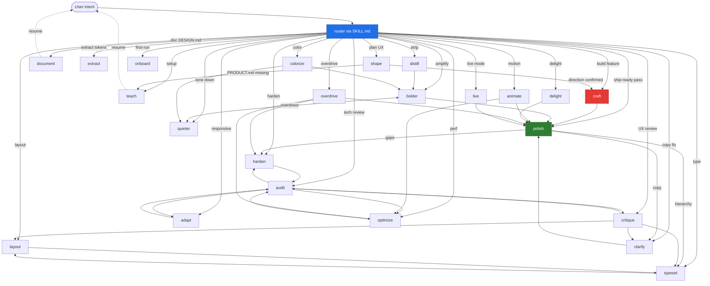

# Patch 5 — Inter-command routing graph

## Problem

Each `reference/<command>.md` is self-contained but commands interact: `audit` may surface issues better handled by `critique`; `craft` flows into many other commands; `polish` may discover production gaps that belong in `harden`.

The current SKILL.md "Routing rules" section only handles command dispatch (input → command). It does not formalize **inter-command flow** during execution.

LLMs default to either (a) staying in the current command and producing low-quality output for an off-topic issue, or (b) silently chaining to another command without telling the user. Both are bad UX.

## Fix

Add a uniform `## Routing` block at the end of every `reference/<command>.md` that documents:
- When the LLM should suggest a switch (FROM here → TO that)
- The trigger condition
- Whether to STAY in current command until something specific happens

Also: a top-level `ROUTING.md` file that documents the full graph as Mermaid + table.

## Block template (paste at end of every reference file)

```markdown
## Routing

FROM `<this-command>`, suggest GO TO:

| When you find... | Suggest | Trigger phrase |
|---|---|---|
| <intent shift X> | `<command-X>` | <one-line cue> |
| <intent shift Y> | `<command-Y>` | <one-line cue> |

STAY in `<this-command>` UNTIL: <terminal condition>

Never chain silently. Emit suggestion + STOP, let user invoke the next command.
```

## Per-command routing matrix (initial)

| Command | Suggests... when |
|---|---|
| `craft` | `shape` (always Gate 1) → `craft` continues → `polish` (after build) → `harden` (production gaps) → `live` (visual tuning) |
| `shape` | `craft` (direction confirmed) OR `teach` (PRODUCT.md missing) |
| `teach` | resume original command (auto) |
| `document` | resume original command (auto) |
| `extract` | `harden` (if extracted tokens reveal coverage gaps) |
| `critique` | `clarify` (copy issue) · `audit` (technical concern) · `layout` (rhythm broken) · `typeset` (hierarchy) |
| `audit` | `critique` (UX issue surfaced) · `optimize` (perf) · `adapt` (responsive miss) · `harden` (edge case) |
| `polish` | `harden` (gaps) · `clarify` (copy) · `typeset` (hierarchy) — terminal otherwise |
| `bolder` | `quieter` (overshot) · `polish` (after) |
| `quieter` | `bolder` (undershot) · `polish` (after) |
| `distill` | `bolder` (too sparse) · `polish` (after) |
| `harden` | `audit` (verify after harden) |
| `onboard` | `clarify` (copy) · `animate` (entrance moments) |
| `animate` | `polish` (after) · `optimize` (perf cost) |
| `colorize` | `bolder` (palette amplification) · `quieter` (overstimulating) |
| `typeset` | `polish` (after) · `layout` (if hierarchy fix reveals layout gap) |
| `layout` | `typeset` (if spacing fix reveals type gap) · `polish` (after) |
| `delight` | `polish` (after) — never `overdrive` (different intent) |
| `overdrive` | `polish` (after) · `optimize` (perf cost) · `harden` (edge cases of effects) |
| `clarify` | `polish` (after) |
| `adapt` | `audit` (verify responsive) · `polish` (after) |
| `optimize` | `audit` (verify perf) · `polish` (after) |
| `live` | terminal — user accepts/discards variants; suggest `polish` after exit |

## Mermaid graph for ROUTING.md



## Migration

1. Append the routing block to each `reference/<command>.md` (script-generatable from the matrix above)
2. Create `docs/ROUTING.md` with the Mermaid graph + full table
3. Add to `bun run build` a check that every reference file ends with `## Routing` section (lints for omission)
4. Update SKILL.md to reference `docs/ROUTING.md` from its "Routing between commands" section
