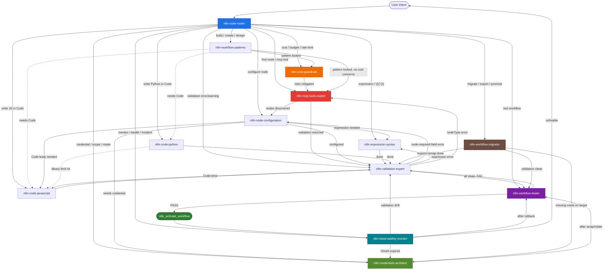

# n8n Skills Suite — Routing Graph (v2)

## Visual graph (Mermaid) — 13 skills



## Routing table (from → to → trigger)

| FROM | TO | TRIGGER |
|---|---|---|
| `n8n-suite-router` | any | initial dispatch on user intent |
| `n8n-workflow-patterns` | `n8n-cost-guardrails` | pattern includes loops/LLM/external API |
| `n8n-workflow-patterns` | `n8n-mcp-tools-expert` | no cost concerns, ready to search nodes |
| `n8n-cost-guardrails` | `n8n-mcp-tools-expert` | risks mitigated, ready to build |
| `n8n-cost-guardrails` | `n8n-workflow-patterns` | mitigation requires re-architecture |
| `n8n-cost-guardrails` | `n8n-code-javascript` | budget/circuit Code needed |
| `n8n-mcp-tools-expert` | `n8n-node-configuration` | node discovered |
| `n8n-mcp-tools-expert` | `n8n-validation-expert` | validation result returned |
| `n8n-node-configuration` | `n8n-credentials-architect` | needs credential |
| `n8n-node-configuration` | `n8n-expression-syntax` | field accepts `{{ }}` |
| `n8n-node-configuration` | `n8n-code-javascript` / `n8n-code-python` | Code node body |
| `n8n-node-configuration` | `n8n-validation-expert` | done configuring |
| `n8n-expression-syntax` | `n8n-validation-expert` | done |
| `n8n-code-*` | `n8n-validation-expert` | done |
| `n8n-code-python` | `n8n-code-javascript` | library limit hit |
| `n8n-validation-expert` | `n8n-node-configuration` / `n8n-expression-syntax` / `n8n-mcp-tools-expert` / `n8n-code-*` | per error type |
| `n8n-validation-expert` | `n8n-workflow-tester` | all clean |
| `n8n-workflow-tester` | `n8n-validation-expert` | FAIL verdict |
| `n8n-workflow-tester` | (activate) | PASS verdict |
| (activate) | `n8n-observability-monitor` | post-ship registration |
| `n8n-observability-monitor` | `n8n-credentials-architect` | OAuth expired |
| `n8n-observability-monitor` | `n8n-validation-expert` | validation drift incident |
| `n8n-observability-monitor` | `n8n-workflow-tester` | after rollback |
| `n8n-observability-monitor` | (user) | unfixable / escalation |
| `n8n-credentials-architect` | `n8n-workflow-tester` | after credential swap/rotate |
| `n8n-workflow-migrator` | `n8n-validation-expert` | after import |
| `n8n-workflow-migrator` | `n8n-workflow-tester` | after import clean (mandatory) |
| `n8n-workflow-migrator` | `n8n-credentials-architect` | target instance missing creds |
| any | (ship) | tester PASSED AND observability registered |

## Gate rules (hard constraints)

1. **Every** `mcp__n8n__*` tool call MUST be preceded by `n8n-mcp-tools-expert`
2. **Every** workflow build MUST be preceded by `n8n-workflow-patterns`
3. **Every** validation result MUST be interpreted by `n8n-validation-expert`
4. **Every** workflow activation MUST be preceded by `n8n-workflow-tester` PASS verdict
5. **Every** activated workflow MUST be registered with `n8n-observability-monitor`
6. **Every** workflow with loops/LLM/external API MUST pass through `n8n-cost-guardrails`
7. **Every** credential operation MUST go through `n8n-credentials-architect` (never inline)
8. **Every** migration MUST execute all 6 phases of `n8n-workflow-migrator`
9. `n8n-code-python` MUST surface "JS-first" guidance unless user explicitly insists
10. `n8n-suite-router` only routes — never solves
11. `n8n-observability-monitor` does NOT poll — delegates to `watchdog-autonomous`

## Composite flows (end-to-end production patterns)

### A) Build + ship new webhook workflow
```
router → patterns (Webhook Processing)
       → cost-guardrails (if loops/LLM)
       → mcp-tools (search nodes)
       → node-config + credentials-architect (provision creds)
       → expressions ($json.body fields)
       → validation
       → tester (4+ fixtures)
       → activate
       → observability-monitor (register)
```

### B) Debug a failing production workflow
```
router → observability-monitor (read incident)
       → triage → recipe OR
       → validation (if drift) → tester (re-verify after rollback)
       → re-activate
```

### C) Build AI Agent workflow with cost controls
```
router → patterns (AI Agent)
       → cost-guardrails (Pattern D: token budget cap)
       → mcp-tools (ai_agents_guide() + search nodes)
       → node-config (8 connection types)
       → code-javascript (cache + budget cap Code nodes)
       → credentials-architect (LLM API key + spend cap)
       → validation → tester → activate → observability-monitor
```

### D) Migrate Python Code → JavaScript
```
router → code-python (read existing logic)
       → code-javascript (rewrite with $helpers.httpRequest)
       → validation → tester → activate
```

### E) Promote workflow dev → prod
```
router → workflow-migrator
       → Phase 1: Export from dev
       → Phase 2: Audit (find env-coupled values)
       → Phase 3: Re-map (creds via credentials-architect, URLs)
       → Phase 4: Version diff (recipes for breaking changes)
       → Phase 5: Import + validation
       → Phase 6: tester
       → (user) activate
       → observability-monitor (register prod)
```

### F) Quarterly credential audit
```
router → mcp-tools (n8n_audit_instance)
       → credentials-architect (MIGRATE hardcoded, RIGHT_SIZE over-scoped, CLEANUP orphans)
       → tester (verify all dependent workflows after swaps)
       → observability-monitor (re-register if SLOs change)
```
