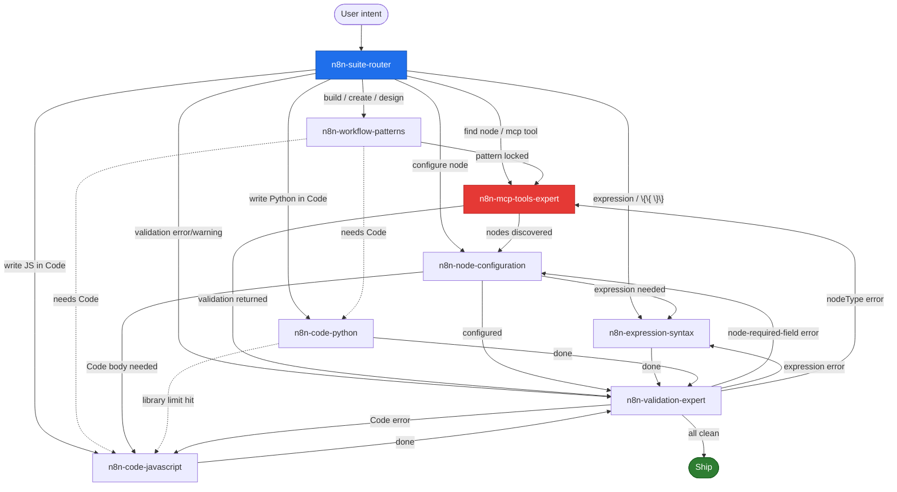

# n8n Skills Suite — Routing Graph

## Visual graph (Mermaid)



## Routing table (from → to → trigger)

| FROM | TO | TRIGGER |
|---|---|---|
| `n8n-suite-router` | any | initial dispatch on user intent |
| `n8n-workflow-patterns` | `n8n-mcp-tools-expert` | pattern locked, ready to search nodes |
| `n8n-workflow-patterns` | `n8n-code-javascript` | pattern requires Code node |
| `n8n-workflow-patterns` | `n8n-code-python` | pattern + user insists on Python |
| `n8n-mcp-tools-expert` | `n8n-node-configuration` | node discovered, needs setup |
| `n8n-mcp-tools-expert` | `n8n-validation-expert` | validation tool returned result |
| `n8n-mcp-tools-expert` | `n8n-workflow-patterns` | pattern was not pre-selected |
| `n8n-node-configuration` | `n8n-expression-syntax` | field accepts `{{ }}` and needs data |
| `n8n-node-configuration` | `n8n-code-javascript` | Code node body needed |
| `n8n-node-configuration` | `n8n-code-python` | explicit Python Code node |
| `n8n-node-configuration` | `n8n-validation-expert` | configuration done |
| `n8n-expression-syntax` | `n8n-code-javascript` | transformation needs loops/branching |
| `n8n-expression-syntax` | `n8n-validation-expert` | expression valid but workflow still errors |
| `n8n-code-javascript` | `n8n-validation-expert` | Code written, validate |
| `n8n-code-python` | `n8n-code-javascript` | hit a library limitation |
| `n8n-code-python` | `n8n-validation-expert` | Code written, validate |
| `n8n-validation-expert` | `n8n-node-configuration` | required-field error |
| `n8n-validation-expert` | `n8n-expression-syntax` | expression error |
| `n8n-validation-expert` | `n8n-mcp-tools-expert` | nodeType / tool-shaped error |
| `n8n-validation-expert` | `n8n-code-javascript` | Code node JS error |
| `n8n-validation-expert` | `n8n-code-python` | Code node Python error |
| any | (ship) | validation returns no errors AND warnings triaged |

## Gate rules (hard constraints)

1. **Every** `mcp__n8n__*` tool call MUST be preceded by `n8n-mcp-tools-expert`
2. **Every** workflow build MUST be preceded by `n8n-workflow-patterns`
3. **Every** validation result MUST be interpreted by `n8n-validation-expert`
4. `n8n-code-python` MUST surface "JS-first" guidance unless user explicitly insists
5. `n8n-suite-router` only routes — never solves

## Composite flows (most common end-to-end)

### A) Build new webhook workflow with Slack notification
```
router → patterns (Webhook Processing)
       → mcp-tools (search Webhook, search Slack)
       → node-config (configure Webhook path, Slack channel)
       → expressions ($json.body fields)
       → validation
       → ship
```

### B) Debug a failing workflow
```
router → validation (read errors)
       → [routes to specific skill per error type]
       → fix → validation → loop until clean
       → ship
```

### C) Build AI Agent workflow
```
router → patterns (AI Agent pattern)
       → mcp-tools (ai_agents_guide() + search nodes)
       → node-config (8 connection types)
       → code-javascript (if custom tool needed)
       → validation
       → ship
```

### D) Migrate Python Code → JavaScript
```
router → code-python (read existing logic)
       → code-javascript (rewrite with $helpers.httpRequest)
       → validation
       → ship
```
